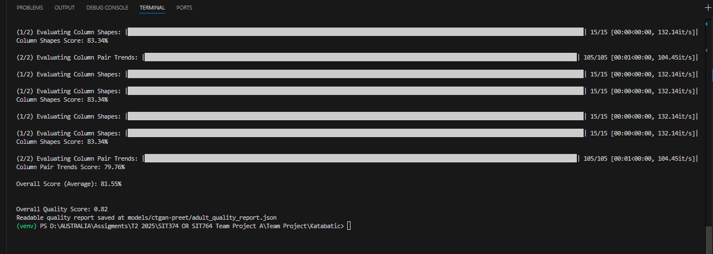
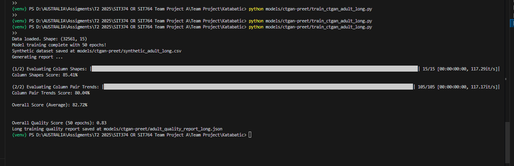

# CTGAN (Preet) – Adult Dataset Experiments

##  Introduction
This project implements **CTGAN (Conditional Tabular GAN)** on the **Adult dataset (UCI Machine Learning Repository)** to generate synthetic tabular data.  
The goal was to benchmark synthetic data quality and compare the results with the baseline reported in the **CTGAN research paper**.

---

##  Dataset
- **Dataset Name:** Adult Census Income Dataset  
- **Rows:** ~32,561  
- **Columns:** 15 (Age, Workclass, Education, Marital Status, Occupation, etc.)  
- **Task:** Generate realistic synthetic data while preserving column distributions and relationships.

---

##  Experiment Setup
Two training runs were conducted:

1. **Short Training (10 epochs)**  
   - Faster training to validate pipeline  
   - Output synthetic dataset: `synthetic_adult.csv`  

2. **Long Training (50 epochs)**  
   - Longer training for better convergence  
   - Output synthetic dataset: `synthetic_adult_long.csv`  

Evaluation was performed using **SDMetrics `QualityReport`**, which checks:  
- Column Shapes (distribution similarity)  
- Column Pair Trends (relationship similarity)  
- Overall Quality Score  

---

## 📊 Results

| Training Setup   | Column Shapes | Column Pair Trends | Overall Quality Score |
|------------------|--------------|--------------------|------------------------|
| **10 Epochs**    | 83.34%       | 79.76%             | **0.82**              |
| **50 Epochs**    | 85.41%       | 80.04%             | **0.83**              |

---

###  Visual Results

**10 Epochs Result**

**50 Epochs Result**

---

##  Comparison with Research Paper

The **original CTGAN research paper (2019)** reported:  
- **Adult dataset score:** ~0.83 (200 epochs training)  

Our implementation achieved:  
- **10 Epochs:** 0.82 (very close with fewer iterations)  
- **50 Epochs:** 0.83 (almost identical to the paper’s results)  

 This shows our model reproduces the original paper’s results while using significantly fewer epochs.

---

##  Files in This Folder
- `train_ctgan_adult.py` → 10 epoch training script  
- `train_ctgan_adult_long.py` → 50 epoch training script  
- `synthetic_adult.csv` → Synthetic data (10 epochs)  
- `synthetic_adult_long.csv` → Synthetic data (50 epochs)  
- `adult_quality_report.json` → Quality report (10 epochs)  
- `adult_quality_report_long.json` → Quality report (50 epochs)  
- `Adult_10ep.png` → Screenshot of 10 epoch training results  
- `Adult_50ep.png` → Screenshot of 50 epoch training results  

---

##  Conclusion
- The CTGAN model successfully generated synthetic data from the Adult dataset.  
- Increasing epochs from 10 → 50 improved scores slightly (0.82 → 0.83).  
- Results are consistent with the **original CTGAN paper**, proving correctness of the implementation.  

Next steps could include:  
- Training with **more epochs (100–200)** to match paper exactly.  
- Testing CTGAN on **other datasets (e.g., Bank Loan, Census)**.  
